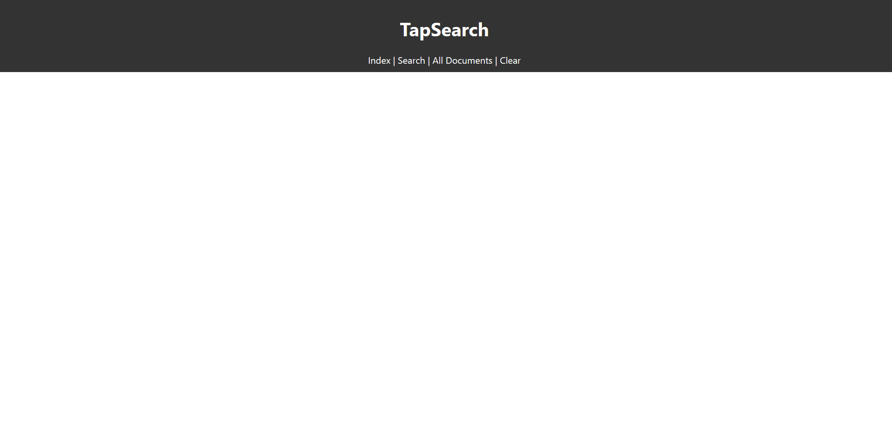
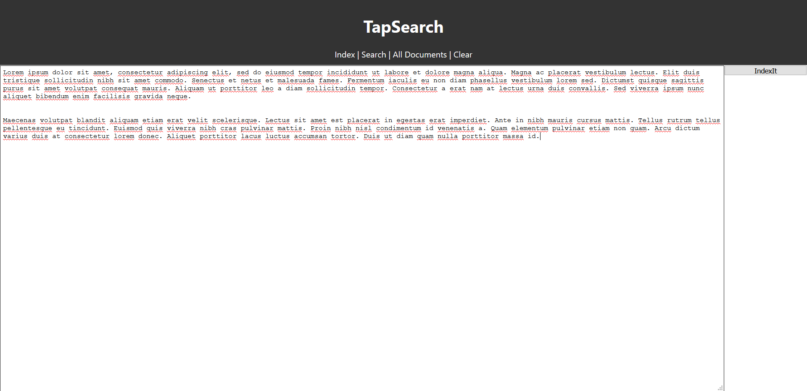
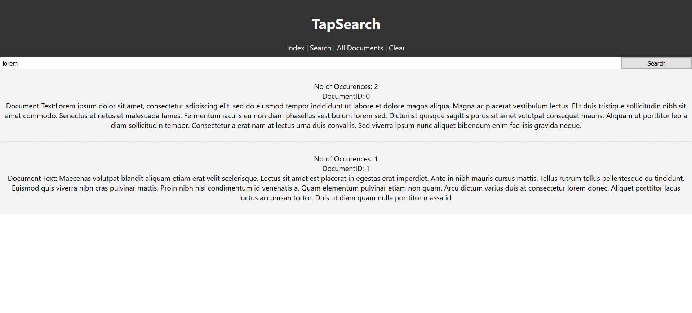
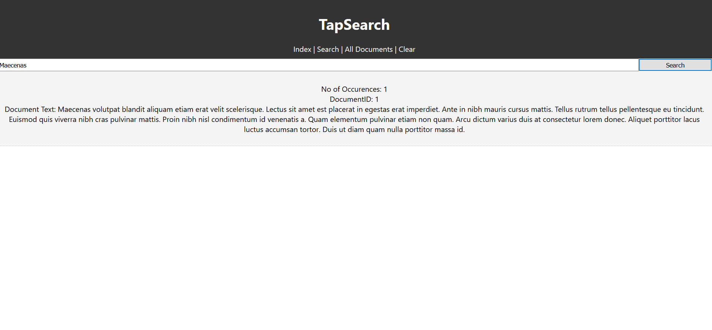
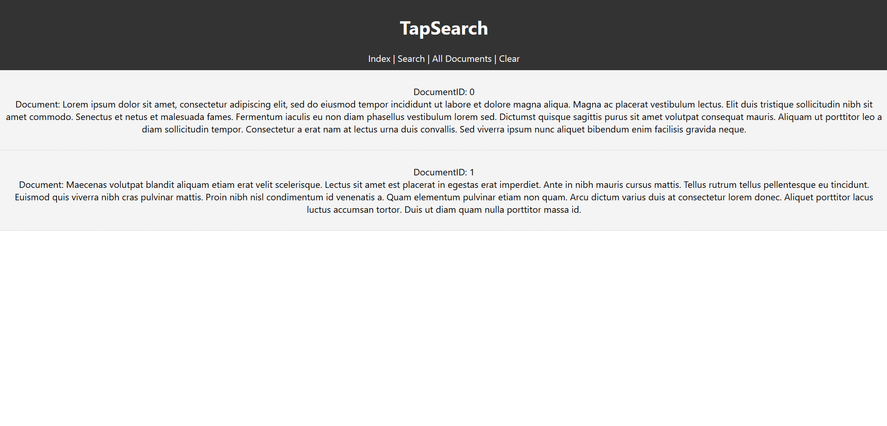

# :new_moon: TapSearch
A simple search engine for documents based on inverted-index. ReactJs for frontend and Djano Rest Framework for Rest API.  
Deploying frontend on Github pages and backend on heroku.

#### USECASE: 
Can be used to index documents and words in the document. 
Can be used to search words present in different documents.

#### REST APIs: 
index: Index the entrered set of paragraphs. 
search: Search for the given words in the documents. 
getALl: View all the documents present in the db. 
clear: Clear all the indexes in the db. 

#### TECHSTACK:  
Python  
Django 
Django Rest Framework 
ReactJs 
Heroku

#### How to use: 
Given the frontpage of the TapSearch website. Clich on Index  
  
Enter the documents or paragraphs to be indexed and press index it.  
  
Go to search page and search for the specific word in each document.  
  
  
Go to All Documents to get all the documents that has been indexed.  
  
Press clear to clear all the indexed documents.  
  

#### Future Prospects 
The given webapp can be further improve by adding phrase indexing. so that we can seach for phrases. 
The search can be modified search that we can get all the paragraphs that contains the word the user has typed untill now.
